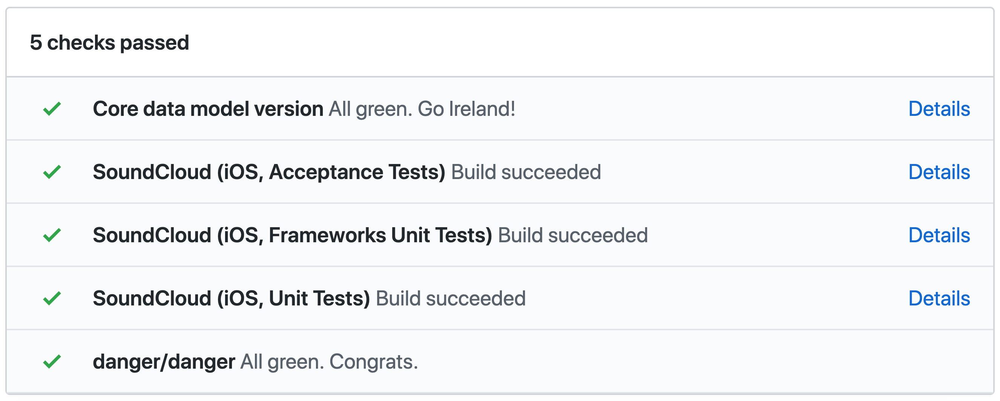
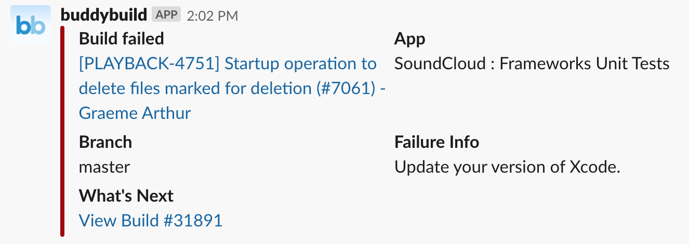
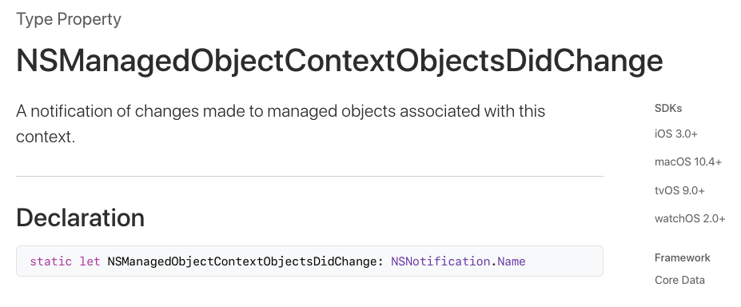
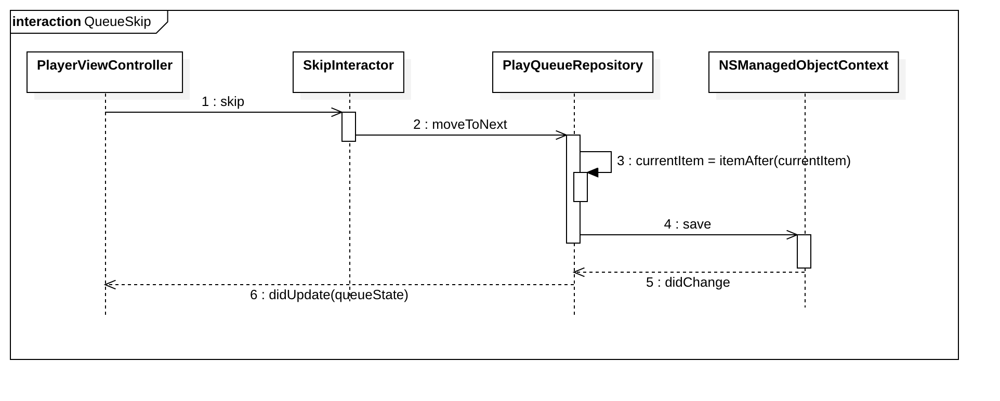
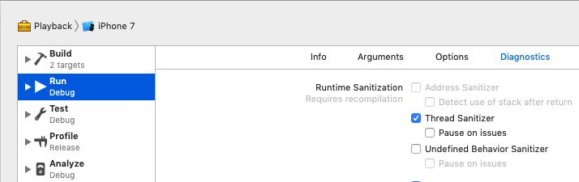
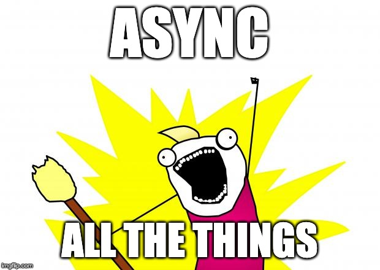

autoscale: true
background-color: #FFFFFF
text: #333333
text-emphasis: #FF3300
text-strong: #FF3300
header-emphasis: #FF3300
header-strong: #FF3300
header: #333333
build-lists: true
<!--Footer: Being Reactive (without Rx)-->


<!-- 
- Presentation for AltConf-Berlin, 02.2019. 40 mins talk + 10 mins Q/A)) 
- 5 minutes Introduction 
- 10 minutes What?
- 10 minutes Why?
- 15 minutes How?
- 10 minutes Q/A
-->

<!-- SECTION 1: Introduction to the talk -->


[comment]: # (What's the talk about))

# *Being Reactive* 
## (without Rx)
#### AltConf-Berlin June 2019

---

^ 
# *Hallöchen!*

^ Good morning. Welcome to AltConf Berlin.

---


### *I'm Graeme*

---
## 🏴󠁧󠁢󠁳󠁣󠁴󠁿

^ I grew up in Scotland

---
## 🏴󠁧󠁢󠁳󠁣󠁴󠁿🎵

^ I love music, initially studied is at university
 
---
## 🏴󠁧󠁢󠁳󠁣󠁴󠁿🎵🤦‍♂️

^ After some years, realised I wasn't good enough to make a steady living

---
## 🏴󠁧󠁢󠁳󠁣󠁴󠁿🎵🤦‍♂️💻

^ Around the same time I was getting into programming

---
## 🏴󠁧󠁢󠁳󠁣󠁴󠁿🎵🤦‍♂️💻📱

^ Went back to uni to study, then got a job as an iOS developer

---
## 🏴󠁧󠁢󠁳󠁣󠁴󠁿🎵🤦‍♂️💻📱🇩🇪 

^ This took me to Berlin so I could work for...

---

### Media Streaming ⏯
### @ SoundCloud


^ SC, where I work on the MS team
^ Anyone here heard of SC?
^ Anyone here use SC?
^ Anyone here found any bugs on SC?
^ If they're playback bugs, come talk to me after!

---

## ⚠️ *Disclaimer* ⚠️

^ This talk is based on my own experiences with the mentioned frameworks and paradigms
^ The opinions or experiences expressed are not intrinsic to the frameworks
^ Not everyone has the same limitations or is working at the same scale. That's totally fine!
^ There's often more than one "right" way of doing things. Nothing I suggest is here the be all and end all

---

[.build-lists: false]

# *Being Reactive* (Without RX)

## Agenda

- *What?*
- *Why?*
- *How?*
- *Questions/Answers*

^ First I'll tell you a little bit about what I mean by being reactive and some of the RP frameworks available
^ I'll then explain to you why it's good to be reactive giving some some examples
^ Then I'll explain to you how you can stay reactive without depending on a 3rd party framework
^ Finally we'll end with you asking me some questions and I'll try and ask them
^ Speaking of questions, let's start the talk with a question...

---

# *What?*

^ What do we mean when we say reactive?
^ Let's start at the most abstract level. The dictionary definition

---

> _reactive | rɪˈaktɪv |_
> acting in response to a situation rather than creating or controlling it

^ In the case of an iOS app, we could immediately think of a response to a user tap
^ Or a response to property on some entity in a database changing
^ Or a response to a player's playhead progressing
^ So what do we mean when we're talk about reactive sofware?

---

## Reactive Software

- Responsive
- Scalable
- Resilient
- Message-driven

^ A responsive application is one of the most, if not the most important the goal.
^ A responsive application needs to be both:
^ scalable i.e adaptive to increases in load and functionality
^ resilient i.e able to handle errors and edge cases
^ We can achieve all of the above by being message driven

---

[.build-lists: false]

## Reactive Software

- Responsive
- Scalable
- Resilient
- *Message-driven*

^ A message-driven system is the foundation of scalable, resilient, and ultimately responsive systems.
^ Reactive programming as a paradigm concerns itself with propagating change through a system as streams of events and data
^ It's been seen as a solution to creating responsive, scalable and resilient UI systems. Something we all care about!

---

## The Reactive Manifesto


[https://www.reactivemanifesto.org/](https://www.reactivemanifesto.org/)

^ Reactive manifesto declares and describes these traits and why they're good
^ Jonas Bonér wrote a blog post in 2013 and shared this manifesto.
^ It's now a living document that can be found at the url shown here
^ Being reactive to events is something very relevant to me as a Playback engineer on the Media Streaming team

---


^ 
- This screen-grab is around ten seconds long, yet we can see
- A player play event
- Several player progress events
- Two play queue skip events
- A player buffering event
- A player error event
- Quite a few events for such a short space of time!
- Heads-up, I'll be using the player and play queue as an example throughout the talk

---

## RxSwift


^
- Direct port of Reactive Extensions which are essentially...
- Observer pattern++
- Reactive Extensions are Implementation standards of reactive programming
- provide a blueprint for the tools to be implemented in multiple programming languages.
- RxSwift is a swift port
- The foundation of RX is the Observable type

---

`Observable<Element>` ≈ `Sequence<Element>`

^
The observable type is similar to a swift sequence. Both represent a series of elements. But there are some slight difference.

---

```swift
let ints: [Int] = [0, 1, 2, 3]
let stringsFromInts = ints.map { "\($0)" }
print(stringsFromInts)

// ["0", "1", "2", "3"]

```
^
^ Let's start by having a look at a familiar Sequence type from the swift standard library, Array
^ This should be fairly familiar to most of you. We have an array of ints and we call map
^ We then print the strings from ints
^ In this case, the values are represented in space as values in memory

---
```swift
let ints: [Int] = [0, 1, 2, 3]
let stringsFromInts = ints.map { "\($0)" }
stringsFromInts.forEach {
    print($0)
}

/*
 0
 1
 2
 3
*/

```

^ 
- As an array is a sequence type, we can also perform functions such as map to perform some action on each of its elements 
- forEach is a another example. Here, we're using is to print each element to the console

---

```swift
import RxSwift

let player = AudioPlayer()
let progress: Observable<Int> = player.observableProgress
let progressStrings = progress.map { "\($0)" }

progressStrings.subscribe(onNext: { 
	print($0) 
})

player.play()

/*
0
1
2
3
*/

```

^ Now here's another example, this time using an RxSwift Observable instead of an array
^ For the RxSwift geeks out there, I've intentionally left out the disposing. It's a potentially confusing detail that's not important for this talk. Everyone else, forget I just said anything!
^ As we did with the array, we call map on the Observable
^ This time, however, we're going to print in the "next" block in the subscribe function of the strings
^ We can see that over time, the strings are printed to the console
^ The output is similar to that of the forEach block, but the printing is happening asynchronously rather than synchronously as the player sends each value
^ In this case, the values are represented not in space as values in memory, but in time as events
^ You'll notice that this example gets the progress from a player.
^ We could, instead of printing the values, display them on a player playhead UI

---


^ This represents a great tangible example. One that's very relevant to my day-to-day at SoundCloud!

--- 


^ How many people have used ReactiveCocoa or its pure Swift core, ReactiveSwift?
^ It's been around for longer than RxSwift
^ How is it different from RxSwift?
^ It's not a direct port of Rx.
^ It's more inspired by FRP

---

```objectivec
@import ReactiveCocoa;

AudioPlayer *player = [[AudioPlayer alloc] init];
RACSignal *playerProgress = self.player.progressSignal;
RACSignal *playerProgressStrings = [progress map:^(NSNumber *progressDuration) { 
	return progressDuration.stringValue; 
}];

self.disposable = [progressStrings subscribeNext:^(NSNumber *progressString) { 
	NSLog(progressString);
}];

[self.player play];

/*
0
1
2
3
*/
```

^ Now here's the same example again, this time using a reactive cocoa Signal
^ As we did previously we call map on the signal
^ We again print in the "next" block in the subscribe function of the strings
^ Again, over time, the strings are printed to the console

---
#🛑

^ But wait a minute... those of you who have used ReactiveCocoa before might be a bit confused

---

```objectivec
@import ReactiveCocoa;

AudioPlayer *player = [[AudioPlayer alloc] init];
RACSignal *playerProgress = self.player.progressSignal;
RACSignal *playerProgressStrings = [progress map:^(NSNumber *progressDuration) { 
	return progressDuration.stringValue; 
}];

self.disposable = [progressStrings subscribeNext:^(NSNumber *progressString) { 
	NSLog(progressString);
}];

[self.player play];

/*
0
1
2
3
*/
```

^ 
- This isn't the API that you recognise...
- Also, why is it all in Objective-C?

---
#😬

^ That's because, unfortunately, at SoundCloud, we're still stuck on ReactiveCocoa v3
^ ReactiveCocoa is now on version 10!
^ The scale of the changes we had to make to update were so great that we never managed to migrate
^ Since then, we decided to deprecate our usage of ReactiveCocoa.
^ Though it's still so widely used that we've actually just moved the whole framework into our own codebase and maintain it ourselves.
^ We found that, as we scaled, it was too much of an on-boarding cost
^ There's a lot of paradigms to learn before you can even begin to read or understand the code
^ Most developers are just not used to working with it day to day
^ Furthermore, when not used properly, you can end up with some really confusing code
^ As mentioned before, this is a not a poor reflection on ReactiveCocoa itself
^ It just didn't make sense for us anymore. We're now building newer features in swift without any large 3rd party dependencies

---


[UIKonf 2018](https://www.youtube.com/watch?v=fmzA7cLyKv0)

---

# *Why?*

^ Why did you decide to do this in the first place?
^ Why try reactive programming?
^ What is it about "being reactive" so attractive?

---

## Reactive Processes

^ Let's think about some other beneficial examples of being reactive.
^ Who here writes tests? 
^ Unit, acceptance, integration, whatever?
^ Tests are great...

---

#⏱


^ But they take time. 
^ We don't want to sit an wait for all our tests to run before we open a PR

---

## *Continuous Integration!*


^ Instead, we set up a CI pipeline so that, when we open a PR, the tests run automatically
^ The CI system is "reacting" to a PR being opened for a particular branch
^ This means you can get on with doing other stuff

---

## *Continuous Integration!*


^ Furthermore, if merging to master ends up causing a failure
^ Buddybuild will react by sending as an "event": a Slack message

---

## Comments as "readable" documentation 👎                              

```swift

// When this function is called 
// it will call the delegate

func doThing()

```

^ 
- Who here likes comments?
- I have to admit that I don't
- You have to think to read the comment before you do something that breaks the behaviour
- There's nothing to stop you breaking the behaviour and not updating the comment
- The comment is not bound in any way to the behaviour
- The comment can become out of date
- If only our documentation was runnable so it could break when changed...

---

## *Unit tests as runnable documentation* 👍

```swift

func test_doThing_informsDelegate() {
	subject.doThing()
	XCTAssert(mockDelegate.didDoThingWasCalled)
}

```

^ 
- That's where unit tests come in!
- If you change the behaviour documented in the unit test, the test will fail
- Okay, when you update the test, you _could_ leave it named the same way...
- But we're all better than that aren't we!

---

## The Reactive Manifesto


[https://www.reactivemanifesto.org/](https://www.reactivemanifesto.org/)

^ 
- So what's great about reactive software?
- Let's return to this image from the Reactive Manifesto
- As mentioned before, the most important goal is that it helps us create responsive UI applications
- But, as indicated by the diagram, it doesn't stop there. By taking a reactive, message driven approach, we also end up with more maintainable, extensible systems and codebases
- That all sounds great, but how can we achieve this?

---

## *How?*

^ 
- How can we achieve this?
- How can we do it without depending on a big 3rd party framework?

---

## Events

^ 
- Try to think about everything that happens in your software as an event which is propagated from its source of truth to all the places that care about it
- For example, a user pressing a button
- A database being updated
- A Player progressing

---

### Events

```swift

enum PlayerState {
	case loading
	case playing
   	case paused
	case finished
	case error
}

struct PlaybackStateEvent {
	let playerState: PlayerState
	let progress: TimeInterval
	let itemID: Urn
}
```

^ 
- Consider the example of a player
- We might create a PlaybackState event that is sent whenever something about the player changes
- This would give us everything we need to update the player UI
- But the fact is, this is actually more than one event here
- Player state and progress don't change at the same time

---

### Events

```swift

enum PlayerState {
	case loading
	case playing
   	case paused
	case finished
	case error
}

struct PlayerStateEvent {
	let playerState: PlayerState
	let itemID: Urn
}

struct ProgressEvent {
	let progress: TimeInterval
	let itemID: Urn
}
```

^ 
- So we should separate them into different events
- The item itemID here is not necessarily part of the high level event, but it helps us identify where it's come from
- But we can go wild with making things too atomic and separating things too much which can create too much fragmentation.
- Sometimes, it's okay to group things together

---

### Temporal cohesion

^ 
- We can group changes together as long as we know they'll happen at the same time.
- The changes are temporarily cohesive

---

### Temporal cohesion
```swift
struct PlayQueueItemEvent {
	let previousItem: Urn
	let currentItem: Urn
	let nextItem: Urn
}

```
^ 
- Consider a player's play queue, for example. It's safe to assume that when the current item changes, the previous and next will too.
- Therefore it's probably okay to group these together into a single event.
- This is actually pretty similar to the way we prepare pages for the Player UI in the SoundCloud app, similar to cell reuse in UICollectionView and UITableView

---

## 👎

```swift
struct PlayerViewState {
	let progress: TimeInterval
	let status: PlayerStatus
	let isLiked: Bool
}
```

^ 
- Be very careful of this sort of thing. 
- A common pattern I see is to have some data structure or model object which represents the structure of the UI
- But if we design our UI components like this without thinking about whether the values are temporarily cohesive, we will run into trouble
- Whenever one of these values changes, we'd need to know the value of all of them to update our UI
- In the worst case, we may end up hitting the "likes" database every time the player progress changes!
- Make sure the timing of your events drive the structure of your UI components, not the other way round!

---

## Eliminate mutable state?

^ 
- I sometimes hear people talking about "eliminating mutable state"
- The reality is, some things are intrinsically stateful, especially in native app development
- Instead...

---

## ~~Eliminate~~ Isolate mutable state

^ 
- Try and keep you mutable state in well managed, isolated places
- e.g Databases, 
- Only allow mutation at the source of truth of the state as a reaction to some event.

---



^ 
- This CoreData notification is super useful for these purposes and allows you to observe any changes
- This means you can isolate your state to a CoreData store and have any change propagate as events to places that care about it

---



^
- Here's the example of a play queue skip event
- We can see that the skip event gets propagated through the layers until it ends up at the source of truth; the play queue repository
- This is the place where we can control the mutation of the core data store
- On mutation, the data change event is propagated asynchronously to the UI layer which is observing the change

---


[https://blog.cleancoder.com/uncle-bob/2012/08/13/the-clean-architecture.html](https://blog.cleancoder.com/uncle-bob/2012/08/13/the-clean-architecture.html)

^ 
- If any of my colleagues are here they might laugh as I always pull out this diagram, but it's very useful here
- Who here uses or has heard of VIPER?
- We use VIPER in a lot of places which is an implementation of the Clean Architecture
- {Explain layers}
- In this context, mutable state should be pushed to the outer circle.

---

> Isolate mutation: data flows outwards; events flow inwards

---

## ⚠️📖⚠️


^ 
- Don't read synchronously at all in the control flow of your application logic 
- react to events
- Don't do blocking reads from the source of truth
- If you're going to read at all, make sure it's from somewhere or something that can't change
- I.e from a value typed data structure that's propagated from the source of truth
- Alternatively from some thread safe data access layer, e.g repository pattern
- A common case for wanting to read is on viewDidLoad
- Don't read in viewDidLoad to set some initial state. Instead, observe.
- Usually we'll perform some async triggering action anyway e.g play on player or sync on a datasource

---

```swift
class PlayerViewController: PlayerDelegate {
    let player = Player()
    let statusView = PlayerStatusView()
    
    func viewDidLoad() {
        player.delegate = self
        player.open(item: url)
        player.play()
        statusView.value = player.currentStatus
    }
    
// MARK: PlayerDelegate
    
    func playerDidUpdate(status: PlayerStatus) {
        statusView.value = status
    }
}

```

^
- Here's an example of a Player UI

---

```swift
class PlayerViewController: PlayerDelegate {
    let player = Player()
    let statusView = PlayerStatusView()
    
    func viewDidLoad() {
        player.delegate = self
        player.open(item: url)
        player.play()
        statusView.value = player.currentStatus // 👈⚠️
    }
    
// MARK: PlayerDelegate
    
    func playerDidUpdate(status: PlayerStatus) {
        statusView.value = status
    }
}

```
^
- If you need to provide some interim state while you wait, keep that knowledge in your UI presentation layers
- If observing won't give you what you need when you need it, consider implementing some sort of broadcast or sync function to tell the source of truth to send its state

---

## Data Races

^
- If we read a value that could change asynchronously, we put ourselves at risk of data races
- These happen when you read a value from one thread while it's being written to from another.
- You're opening yourself up to these kinds of problems by providing synchronous read access to mutable state

---

## Data Races



^ 
- When we switched on the thread sanitiser at SC, we found quite a few violations. Almost all were from these kinds of examples.

---


 
^ 
- Try as much as possible to work with async communication patterns
- It makes it a lot harder to introduce data races
- And other race conditions by reading and acting on data that's out of date
- Instead, if you want to provide access to some changing state, try as much as possible to only expose an async API

---

## Flipper

```swift
class FlipperPlayer : NSObject {
	weak var delegate: FlipperPlayerDelegate?

	init(cacheConfig: FlipperCacheConfig, logHandler: FlipperLogHandling)
    
	func play()
	func pause()
	func seek(toTime time: TimeInterval)
	func stop()

    
	func preload(_ url: URL)
	func open(_ url: URL)
    
	func destroy()
}
```

^ 
- Our cross platform player, Flipper is a perfect example. The main iOS app uses this
- Notice that it has no querying API at all. The only way you can receive its state is by subscribing to updates through delegation.
- Delegation just represents one of the async communication patterns we can use, but there are plenty to choose from

---

## Async Patterns

[.list: alignment(left)]

- One recipient, multiple messages?
    - *Delegation*
- One recipient, single message?
    - *Completion block*
- Multiple recipients?
    - *~~KVO~~*
    - (Notifications)
    - *Observer pattern*

^ 
- We have a whole range of async communication patterns
- KVO allows you to still read value synchronously which risks acting on data that's just about to change. This can cause flickering or other bugs.
- Notifications are pretty basic and not type safe. They're okay if there's no additional payload to be sent with the event.
- Really, they can both be replaced by the observer pattern

---

Observer pattern

```swift
struct PlayerProgressSubject<ProgressObserver: ProgressObserving> {
    private var observers: WeakSet<ProgressObserver> = []

    mutating func attach(_ observer: ProgressObserver) {
        observers.insert(observer)
    }
    
    func send(_ event: ProgressEvent) {
        notify(of: event)
    }
    
    private func notify(of event: ProgressEvent) {
        for observer in observers {
            observer.notify(of: event)
        }
    }
}
```

^ 
- One of the 23 Gang of Four design patterns from 1994 book "Design patterns"
- Key part of MVC in some of Apple's older docu 
- Here used to update observers of
- Observers here would be UI components that can be themed

---

```swift
class PlayerProgressObserver: ProgressObserving {
    func notify(of event: ProgressEvent) {
        let progressString = "\(event.progress)"
        print(progressString)
    }
}

let player = AudioPlayer()
let progressSubject = player.progressSubject
let progressObserver = PlayerProgressObserver()
progressSubject.attach(progressObserver)

player.play()

/*
0
1
2
3
*/

```

---

## Inversion of Control
### aka *The Hollywood Principle*
#### "Don't call us, we'll call you" 🤙

^ This implementation, these async communication patterns and lot of what I've been saying can be summed up by the Inversion of control principle
^ aka the Hollywood Principle
"Don't call us, we'll call you"
^ i.e, if you want to know some information that belongs to someone else, don't ask for it, wait for them to tell you it
^ The essence is, if you design your system free of assumptions about how and when you should react to data, and give the control to the components that own the data, you'll have more stable, scalable and responsive software that will not degrade as you alter and replace it's parts

---

# *How?*

- Send/receive events 
- Group event data temporally
- Isolate mutable state
- Don't read mutable state for control flow
- Use async communication patterns
- Inversion of Control

^ So to sum up how we can build reactive software

---

# *Summary*

- *That's What!*
- *That's Why!*
- *That's How!*

^ Today I spoke about what it means to be reactive, what reactive programming is all about and some popular reactive programming frameworks
^ I spoke about why it's good to be reactive and how this applies to some real world process examples
^ I gave you some tips and examples of how you can achieve the goals of being reactive using established patterns and practices from Swift and OO programming in general without depending on any 3rd party reactive programming frameworks

---

### Thanks! 🌍
### Dankeschön! 🇩🇪

---

## 🙋‍♀️ *Questions?* 🙋‍♂️

---

## *SoundCloud is Hiring*
### www.soundcloud.com/jobs


